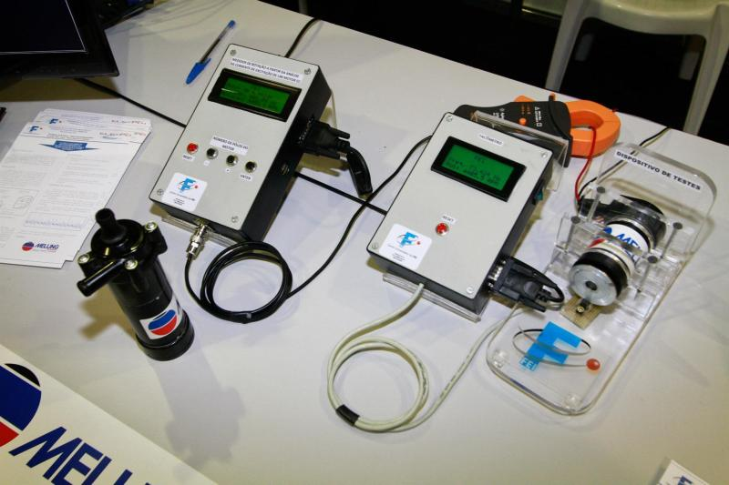

# Medidor de Rotação (_ROTATION METER_)

## Arquivos "MEDIDOR DE ROTAÇÃO PARA MOTORES CC A PARTIR DA ANÁLISE DA CORRENTE DE EXCITAÇÃO"

## _Files for the project "ROTATION METER FOR DC MOTORS BASED ON EXCITATION CURRENT ANALYSIS"_

Firmware para equipamento de medição de rotação para motores de corrente contínua (brushless) a partir da análise da corrente de excitação\
_Firmware for rotation measurement equipment for direct current motors (brushless) based on excitation current analysis_

\
Projeto desenvolvido utilizando processador de arquitetura ARM presente no kit de desenvolvimento STM32VLDISCOVERY, no ambiente IAR Workbench\
_Project developed using ARM architecture processor present in the STM32VLDISCOVERY development kit, in the IAR Workbench environment_

\
Mais informações:\
_More information:_\
https://dx.doi.org/10.13140/2.1.4736.6722

https://www.researchgate.net/publication/316243616_MEDIDOR_DE_ROTACAO_PARA_MOTORES_CC_A_PARTIR_DA_ANALISE_DA_CORRENTE_DE_EXCITACAO

https://www.youtube.com/watch?v=DpYgetGFJIA